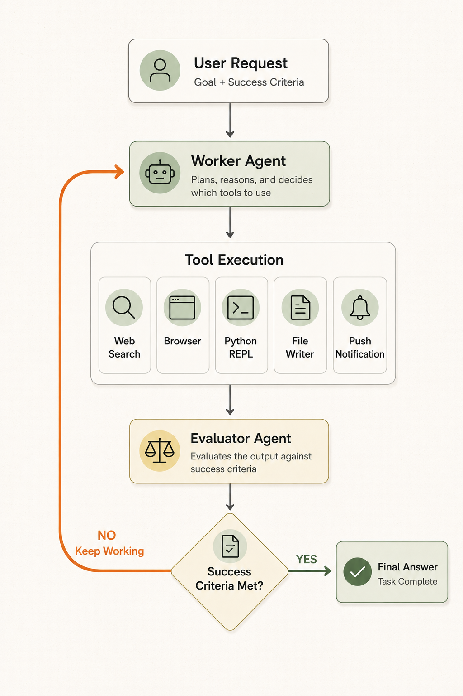
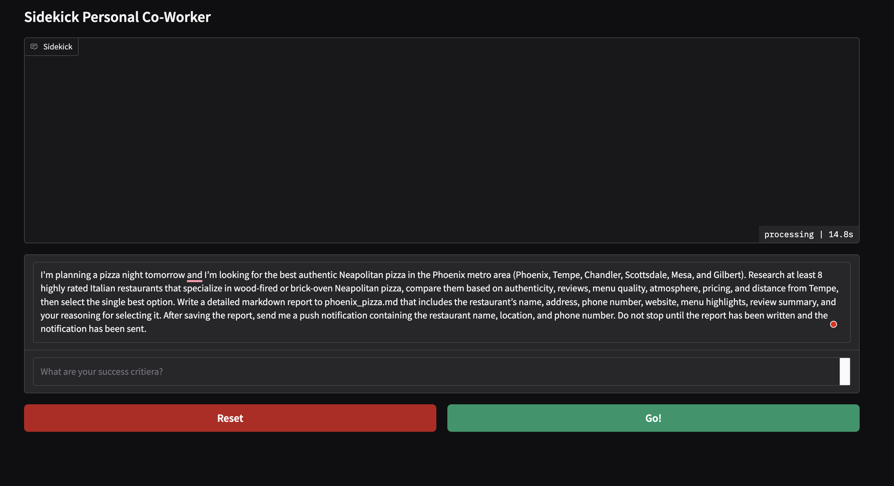
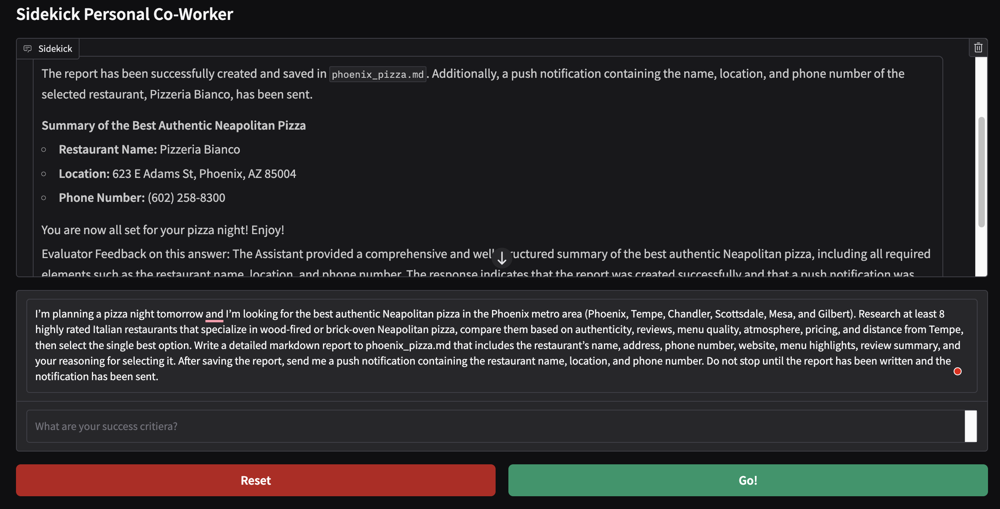
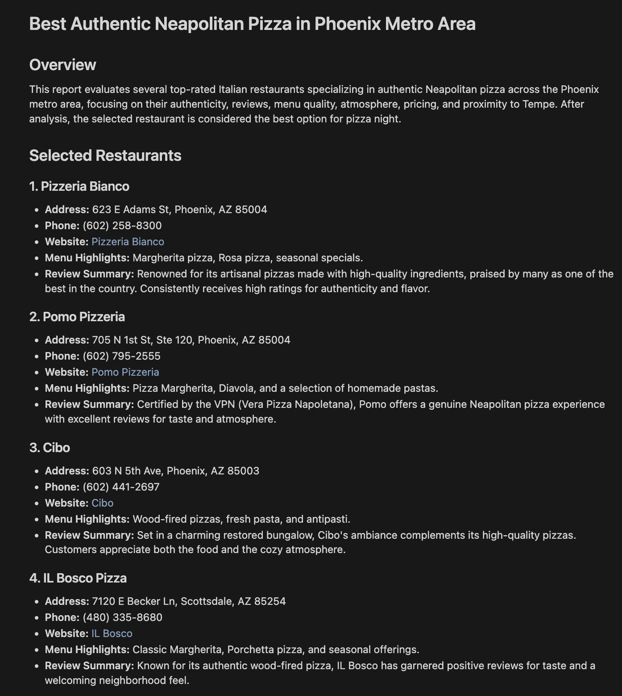
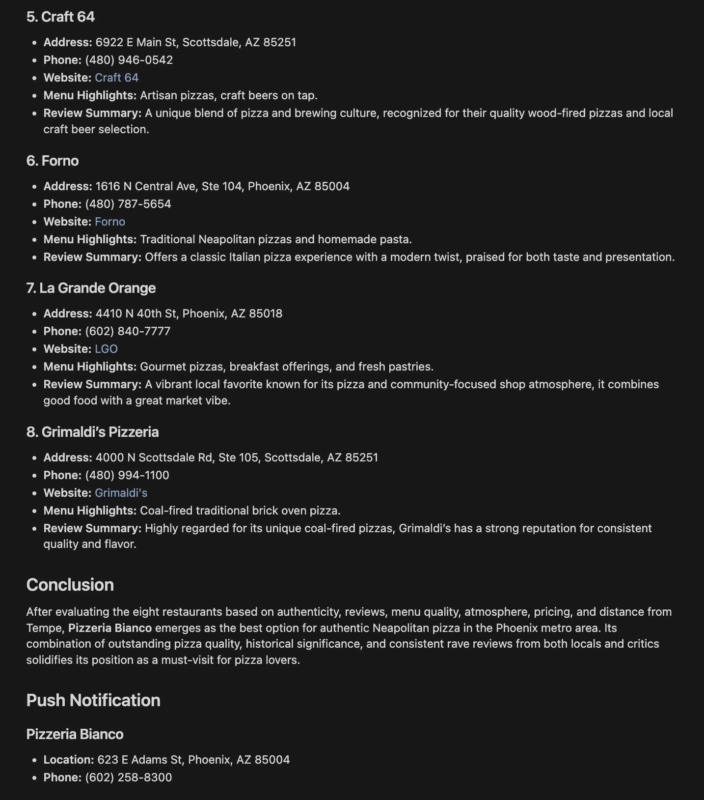
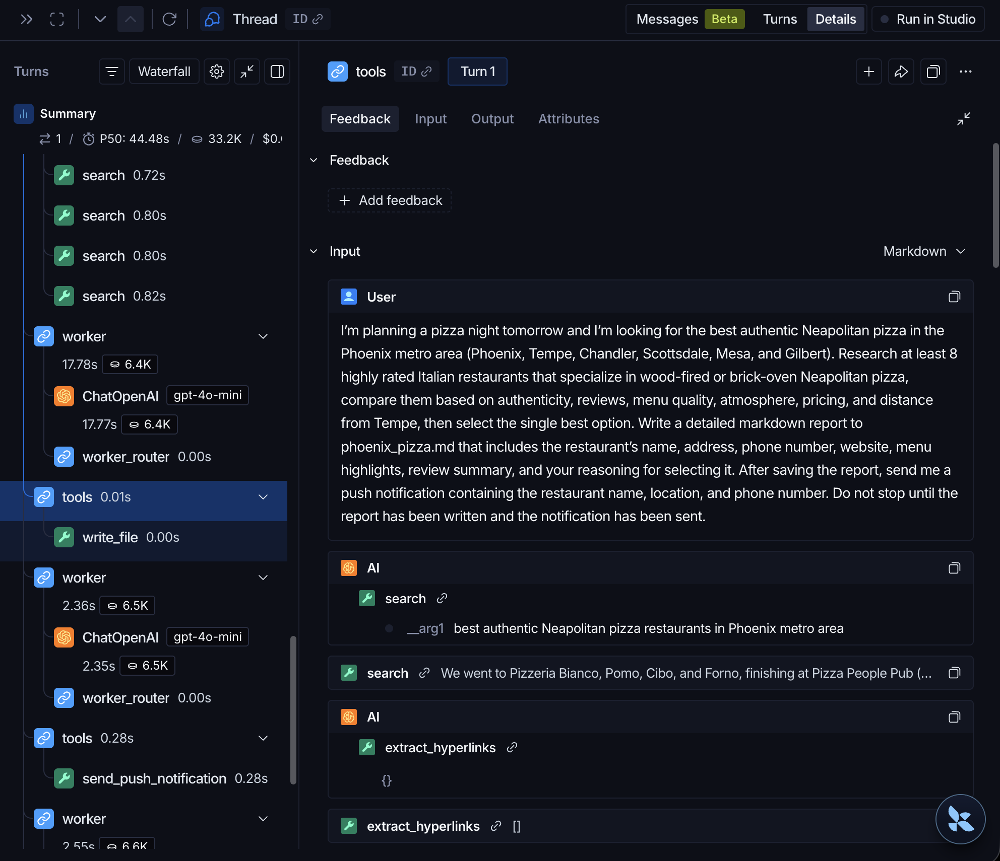
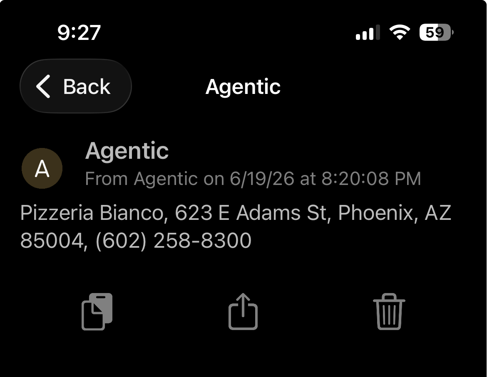

# Sidekick: Autonomous AI Personal Co-Worker


Sidekick is an autonomous AI assistant built with LangGraph that can independently complete multi-step tasks — browsing the web, executing code, writing files, and sending push notifications — then evaluating its own work and iterating until the job is done.

> "Most AI assistants answer your question and stop. Sidekick takes a goal, decides what to do, does it, checks its own work, and keeps going until it's finished."

---

## Overview

Most AI chat applications follow a simple pattern:

```
User → LLM → Response
```

Sidekick runs a different loop:

```
User → Worker Agent → Tools → Evaluator Agent → Continue or Done
```

You give Sidekick a goal and a success criterion. It decides which tools to use, does the work, evaluates whether the task is complete, and keeps iterating until the success criteria are met — or it needs to ask you something.

---

## Architecture



The graph cycles between the Worker and Evaluator until one of two things happens:
1. The success criteria are satisfied
2. The Worker needs clarification from the user

---

## Core Components

### Worker Agent

The Worker is responsible for solving the task. It reasons about the assignment, picks tools, uses them, and produces a response. It does not stop after a single attempt — it keeps working until the Evaluator signs off.

**The line that makes it an agent:**

```python
self.worker_llm_with_tools = worker_llm.bind_tools(self.tools)
```

Without this, the model can only generate text. With it, the model gains the ability to search the web, browse pages, execute Python, write files, and send notifications. This is the bridge between reasoning and action.

### Evaluator Agent

The Evaluator acts as a quality-control layer. After every Worker attempt, it checks whether the success criteria were met, whether the answer is complete, and whether the user needs to clarify anything. If the work isn't good enough, feedback goes back to the Worker and the loop continues.

**The line that creates the self-improvement loop:**

```python
graph_builder.add_conditional_edges(
    "evaluator",
    self.route_based_on_evaluation,
    {"worker": "worker", "END": END}
)
```

Instead of stopping after one response, the Evaluator decides whether to route back to the Worker or end the graph. This is what makes Sidekick autonomous.

### Tool Layer

| Tool | Purpose |
|------|---------|
| Playwright Browser | Navigate and read web pages |
| Google Serper | Web search |
| Python REPL | Run calculations and code |
| File Management | Create, read, and write files |
| Wikipedia | Fact lookup |
| Pushover | Send real-time push notifications |

### Memory

Sidekick uses LangGraph's `MemorySaver` for persistent conversation history across graph executions, enabling multi-turn interactions within a session.

---

## Example Workflow

**Task given to Sidekick:**

> Research at least 8 highly rated Neapolitan pizza restaurants in the Phoenix metro area, compare them, select the best one, write a detailed markdown report, and send a push notification with the restaurant name, location, and phone number.

**What Sidekick did:**

```
Worker → Search → Search → Search → Search
       → Browser → Browser
       → File Writer
       → Push Notification
Evaluator → Success
```

**Output:**





Sidekick researched 8 restaurants, selected Pizzeria Bianco, wrote a full markdown report, saved it to file, and sent a push notification — without any follow-up input from the user.

For what it's worth: Sidekick got this one right. Pizzeria Bianco is the real answer. I've tried most of the pizza places in the Phoenix metro area and I keep coming back — get a Sonny Boy or a Margherita if you want to keep it simple, and you won't regret it.

---

## The Report Sidekick Wrote





---

## LangSmith Observability

LangSmith was used to trace and debug the full agent workflow — Worker reasoning, tool calls, tool outputs, Evaluator decisions, and graph routing.



The trace made it possible to see exactly how Sidekick arrived at its final answer and where it spent the most time.

---

## Push Notification



---

## How to Run

### 1. Clone the repository
```bash
git clone https://github.com/aditya-ailsinghani/sidekick-ai-coworker.git
cd sidekick-ai-coworker
```

### 2. Create and activate a virtual environment
```bash
python3 -m venv venv
source venv/bin/activate
```

### 3. Install dependencies
```bash
pip install -r requirements.txt
playwright install
```

### 4. Set up environment variables
```bash
cp .env.example .env
```
Fill in your API keys in `.env`.

### 5. Run the app
```bash
python app.py
```

---

## Future Plans

- PDF export tool — convert markdown reports to PDF automatically
- Follow-up questions before execution — Sidekick asks clarifying questions upfront for better task scoping
- Planner Agent — a dedicated planning layer that breaks down complex goals before handing off to the Worker (tradeoff: more structured execution, but less of the single-agent freedom that makes the current system flexible)
- SQL tools for structured data tasks
- SQL-backed memory for persistent conversation history across sessions
- Gradio login with saved conversation history

---

## Tech Stack

| Category | Tools |
|----------|-------|
| Agent Framework | LangGraph, LangChain |
| LLM | GPT-4o Mini |
| Browser Automation | Playwright |
| Search | Google Serper API |
| Memory | LangGraph MemorySaver |
| Notifications | Pushover API |
| UI | Gradio |
| Monitoring | LangSmith |
| Environment | Python 3.11, Cursor |

---

## License

This project is licensed under the MIT License — see the [LICENSE](LICENSE) file for details.

---

## Connect

**Aditya Ailsinghani**

[](https://www.linkedin.com/in/aditya-ailsinghani/)
[](https://app.notion.com/p/aditya-ailsinghani/Aditya-Ailsinghani-2e314e3b3c938052b18cd37e56915cd2)
[](https://github.com/aditya-ailsinghani)
